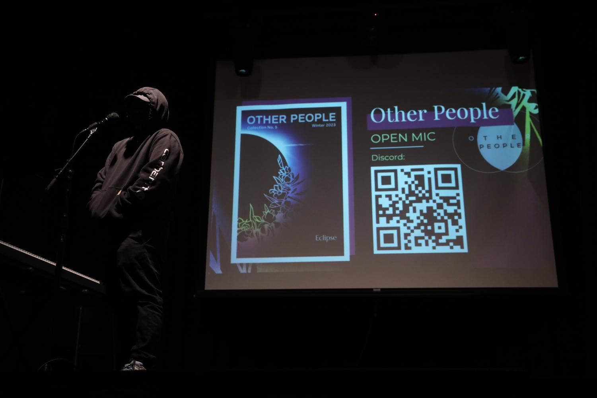

:::note

This article is extracted from [The Guardian](https://ucsdguardian.org/2023/04/23/other-people-magazine-no-tortured-artists-here-a-home-for-any-othered/), University of California, San Diego's independent student newsletter.

:::

*The UCSD Guardian converses with Hallie Macaulay and Nina Gerardi from the Other People Magazine to see how the undergraduate club with humble roots strives to make an all-encompassing atmosphere for those of diverse writing backgrounds among a STEM-focused campus.*

Hallie Macaulay doesn’t twiddle with the little jewelry that decorates her hands or ears. Her hair is often down and she doesn’t stray from eye contact. Perhaps it’s her baggy clothes that show composure though not rigidity — or perhaps it’s because she dances for a UC San Diego group on the side of her academics — but there is an air of self-assuredness around Macaulay. 

Macaulay, a senior in Sixth College, joined the Other People Magazine this year. She’s still working out the small kinks — like figuring out their Google Drive. But otherwise, some might think that she’s been a part of the team for a longer while. 

Alongside Library Walk, [Other People Magazine](https://otherpeoplesd.com/) members sometimes appear to promote their works and get funding. On Valentine’s Day, Macaulay was at a stand to sell realistic long-stemmed red roses with quotes from esteemed writers or poets. She was selling them for a couple of bucks a pop, to help their magazine with funds. This is because the OPM declares itself to be the first completely student-run creative literary magazine that accepts art and literature on UCSD grounds. Their independence, though, means they have to be self-sufficient. 

A few days before Valentine’s, the magazine had its Collection No. 5 “Eclipse” launch party and an Open Mic Night, too — an intimate opportunity for members to be able to share their works. Sometime later, some of the OPM’s works were featured in an art gallery on Library Walk alongside other organizations to showcase UCSD’s art community. 

It’s not surprising to say that Other People Magazine has paved its way to be a ubiquitous presence on campus — especially with its intriguing black-and-white Venn Diagram logo that emphasizes “The People” aspect of it and the unified celebration of both art and technology.

But, it’s still a relatively young club. Macaulay dubs OPM “a COVID baby,” a magazine that kicked off with its first issue in the summer of 2020 amidst uncertainty and undeniable passion from Literature/Writing majors. OPM [isn’t the first creative magazine](https://otherpeoplesd.com/uc-magazines) on campus either. They even coexist with a magazine called “Kaleidoscoped,” brought forward by MFA and graduate students in 2021 as well as others, such as Revellations and [Antifragile Zine](https://ucsdguardian.org/2023/03/12/from-dreams-to-realities-the-antifragile-zine/). OPM is an undergraduate gem that emphasizes its relaxed atmosphere (though they do take submissions from those who have graduated from UCSD as well).

“I’ve always loved to write,” Macaulay said. “And I really like to edit. I was just like … UCSD is such a STEM school, you know? And I was just looking for a creative outlet. I was going to apply for The Guardian. I was going to apply for the MQ. I wasn’t really sure where to go. But then, I heard of Other People through a friend. It reminded me of my high school magazine, which was called the ‘Pen of Iron.’”

Macaulay liked the lax ambiance and quickly found a place to submit her application on their website for staff positions. The website also offers places to submit work, but she specifically wanted to join the team. She applied to be an editor and content writer, where she uploaded her own piece and edited a work respectively for consideration. The magazine touched bases with her in a week or so. She got both positions. 

The magazine has been a safe haven for Macaulay — a home away from STEM just for a bit (unless the design team is involved to help program a piece for experimental purposes). She first underwent an editing workshop to learn how to edit pieces and catch any unintentional errors. The magazine also holds biweekly all-staff meetings and meetings for content writers and the design team. 

Macaulay is one of about seven to ten other editors. The creative editors are responsible for workshopping for structure and form, while copy editors are more akin to those in journalism.

“Our main thing is: I’m here to edit your piece but I’m not here to make it something it’s not,” she said.

The revision process begins when Macaulay reads anonymous pieces then scores them on a scale from 1 to 4. Afterward, votes go in amongst editors to see to it that the work gets published or not. If she wishes to accept a piece, she contacts the writer and conducts a collaborative process of about three meetings with them to proceed in the publishing process.

She strives to make the authors comfortable. Within her own team, sometimes weeks don’t look perfect and members miss deadlines. But members communicate amongst each other without being brusque with one another.

“We get people [for OPM] who just like to write and edit,” she said. “They’re just passionate about it. I think our hearts are in the right place. We just want to create a magazine that’s beautiful and … give the humanities kids somewhere to go, and a place to have their voice heard. No one’s in here for the ego … There’s no person in charge who’s like ‘hey, hey hey.’”

Recently, however, she dropped the content writer role to just be an editor. And the breath of relief was perhaps that there was no penalization or disapproval from her team. Nina Gerardi, a junior from John Muir College and co-editor-in-chief along with senior Zoe Wong, did send her writing exercises and did check-ins with her, but Macaulay couldn’t put pen to paper. So, she didn’t force it.

To Macaulay, academic assignments were one thing and executing something creative was something else. But doing something creative by a deadline was a different playing field she hadn’t found footing in yet. The intrinsic motivation wasn’t kicking in; her poems either didn’t connect to her life now or if they did, she wasn’t certain she wanted people to look at that aspect of her. 

The magazine currently gets submissions numbering in the 80s, sometimes 100, with works ranging from experimental poetry to nonfiction. The content is crucial — the team gets a plethora of poetry and the poems in general are more easily formattable to both online and print —  but there is also a capped number of pieces. Additionally, submissions that are too long or not thematically aligned with the issues will go online instead of in print.

The main goal for the magazine is to address works for the website and works for the print magazine. For “Eclipse”, they received about 40 to 50 submissions. 

Gerardi, took a management course on psychological safety where she concluded that everyone should feel happy in the team, included, and not enmeshed in conflict. When one is a bit quiet or distant, she asks them how they are doing. With Macaulay, she offered grace during her writing block.

Indeed, psychological safety is important for an individual to feel at peace at work. As long as one means well, asking questions and saying or doing things not leading to negative consequences are important measures in feeling safe.

Professor Amy C. Edmonson of Harvard Business School coined the term “psychological safety,” in which one’s security is dependent on how permissible it is to make mistakes, how okay it is for difficult topics to be approached, how much people are willing to help one another, and to what extent one is welcomed for this. For the leader, seeing work as learning problems is important in addition to asking questions.

In OPM, there is a Cerberus-like dynamic with three figures heading the magazine. Wong and Gerardi are the editors-in-chief with Caroline Tjoe as the design director.

Gerardi wears a big smile and her hair in a ponytail. She laughed as she recalled someone mistaking her for a senior in her sophomore year. She gives off a sense of composure but she, like Macaulay, joined not too long ago. She joined last year in Winter Quarter, describing herself as someone who’s always been a writer. 

She decided to be an editor-in-chief because others believed she was detail-oriented and she believed them. Gerardi aimed to make the magazine larger and much more social — as both an organization and a professional production.  After all, the magazine has about 30 members, but the team size isn’t capped yet; she expressed her desire to see the team grow further.

But Gerardi, an aspiring author post-graduation, initially joined as an editor to fine-tune her writing skills. 

“The Other People Magazine is a tight-knit community,” she explained.  “We have connections to the department which made the Seattle conference we went to possible. We have psychological safety. We’re all artists here and we’re all being vulnerable. I want members to feel safe to share. We became a family over the years because we were all open to each other.”

In fact, alumnus Kevin Jang joined OPM in 2021; he grew as a website and newsletter producer as well as a magazine layout designer. He graduated in the fall but is still a present member as a webmaster, which is telling of what the environment means to him.

He does much of the design, particularly experimental pieces, having collaborated with a fellow student to create an animated piece that writes itself called “[missed connections](https://otherpeoplesd.com/missed-connections).” Every written piece is accompanied by a drawing or photography submissions so the visual aspect of the OPM magazine is particularly vital. Everything from the logo to the minimalistic feel of the website is telling of how intertwined the work is to the visual nature of the pieces.

In that particular prose poetry piece, the unknown writer is typing to the audience with every missed beat or deleted sentence detailed on the screen. The audience can sense the backtracking and the pensive state of the author because of the pauses in thinking — everything that would not be visible if the work were written out as a normal piece. 

Jang expresses his excitement for Collection NO. 6, set to come out for the summer. He wrote a program for a choose-your-own-adventure story that he said features “over 75 routes and amusing metacommentary” with a top-secret section, which will again test his inclination to head into experimental prose and poetry waters.

Every year, the magazine strives to publish an issue (but often two) annually. The names for the issues were a tricky process with deliberation on names like “Liminal” and “Dive,” all very minimalistic as well. They decided on the name “Liminal,” a theme birthed from the very nature of the submissions from the students themselves.

Currently, Macaulay is not interested in submitting pieces but she might consider posting a piece of interest after graduation or continuing as a part of the team like Jang post-graduation. 

“[OPM] is like a flower that’s blooming,” Macaulay said. “And the people who are watering it are very pure of heart. And that makes it very special.”