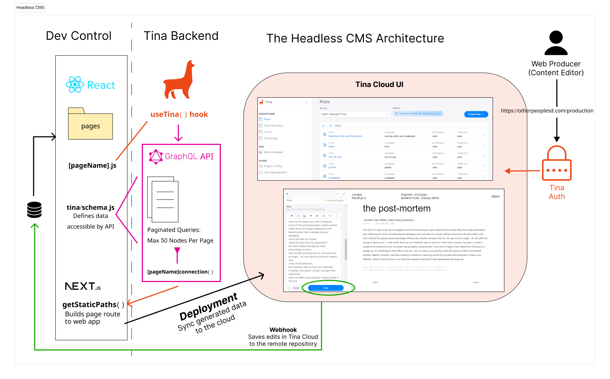

# Architecture


The organization uses GitHub as a codebase for version control, data storage, and collaboration with other developers on the team for the budget available. The website is built in React because this allows it to be able to interact with many modern headless CMSes like TinaCMS for live editing functionality which a vanilla JS website would not be able to do. Next.js is the web framework that generates the website and its parent company Vercel is used for deployment because of first-class support for Next.js websites. 

## Headless CMS: TinaCMS



A headless CMS is a content management system where the content is separate from the interface with which it is managed by the editor. Developers use the API provided by the headless CMS to query the content into the interface and build interactivity. OPM's website uses the TinaCMS headless CMS to give our editors a simple UI with support for live editing while our developers benefit by maintaining the artistic integrity of custom-coded posts that cannot be done by a traditional CMS model. 

This system diagram depicts how TinaCMS interacts with the data and editors. On the data side, the Github-stored dataset uses the React and Next.js frameworks to create the functional pages for posts. The Tina schema file must be defined by the developer to denote what data Tina is able to access. Only pages and their specified fields are able to be modified by TinaCMS, protecting other files from being modified by the CMS and other web producers who may accidentally cause a breaking change. The dashed line separates the data with the mounted CMS by using the useTina hook connection. This allows TinaCMS to query data from the dataset and autogenerate GraphQL nodes and functions to be used in the API. When the website gets built to deployment, the data evaluated in the Tina API is what will be displayed on the webpage through the getStaticPaths function that will generate the rendered pages.

On the editor side, web producers must access the production site and log in through Tina's built-in authentication system which prevents outside adversaries from gaining control of the CMS. Once authenticated, producers will by able to view posts through the Tina Cloud UI. Tina Cloud is a remote view of the dataset independent of the stored dataset in GitHub. This means that edits on the remote Tina Cloud will not automatically show up on the rendered website until they push the change to the remote repository. This is accomplished through a webhook connection from Tina Cloud to the GitHub repository to sync edits on the cloud to the repository.

## Static Site Generation using Next.js and Vercel


Next.js is a framework used to build web applications. Built upon React, this allows Next.js to use HTML templates in the form of JSX to create HTML pages for the client. The templated files are composed of smaller components usually kept within the `components` directory and also the main content components within the `pages` and `_posts` directories. 

The bottom-left block is the pipeline for how content from Markdown-HTML (MDX) files gets parsed into HTML for the static site generator (SSG). The data is not in fact accessed through Next.js as it has to be run through the TinaCMS connection for the live preview editor feature to work. We used a custom-built parser based off the `<TinaMarkdown />` component that TinaCMS uses in order to satisfy our use case. 

The dynamic router is meant to create static paths for each posts without manually creating JS files for each one unlike the landing pages. Please read the Next.js documentation on dynamic routing and view the source code in `[...slug].js` to see how the router is constructed. The templated HTML with parsed HTML and dynamic routes are all sent into the Next.js CL/CI pipeline for static site generation where images and third-party scripts will be optimized using Next.js's functions. 

In addition to SSG, server-side rendering (SSR) occurs to create API endpoints for both future data connections and also research. This API will function properly because the website is deployed on Vercel which has first-class support for SSR by converting the pages into serverless functions. Use cases for SSR include running audits and generating recommendations.

## GitHub Repository Map

This is an overview of important files and folders in the repository. Many of these have been shown in the website architecture for a more visual reference as to how they are used.

```
/
| 
├── _posts              # Published posts, organized into folders
|
├── components          # Building blocks for webpages
|   ├── appContext.js   # Deep-forwards props to specific components
|   └── ContentWarning  # Disables copying published work
|
├── lib                 # Helper functions that run the backend of the framework
|
├── data                # Centralized JSON files used to modify multiple pages together
├── pages               # The pages that are compiled and deployed on the website
|   ├── _app.js         # The container for all components
|   ├── _document.js    # Updates the html and body tags
|   ├── index.js        # Homepage
|   ├── [...slug].js    # Dynamic router to build all posts in _posts
|   ├── api             # API Routing Endpoints
|   └── flipbook        # TODO: Embeddable flipbook
|
├── styles              # CSS using CSS Modules and SASS
├── public              # Styling the website
|   ├── favicons        # Other People Logo
|   ├── fonts           # Basier Mono Circle
|   ├── images          # Folder for media and images, organized into folders
|   ├── js              # Functionality for interactive elements
|   |
|   └── production      # Autogenerated TinaCMS route for content editing 
|
├── tina                # TinaCMS configuration and schema
├── stories             # Storybook for Design System and unit-tested components
├── e2e                 # End-to-end testing (Playwright)
|
├── styledict.config.json # Configures design tokens that are actively used in website
└── next.config.js      # Configuration for Next.JS framework
```