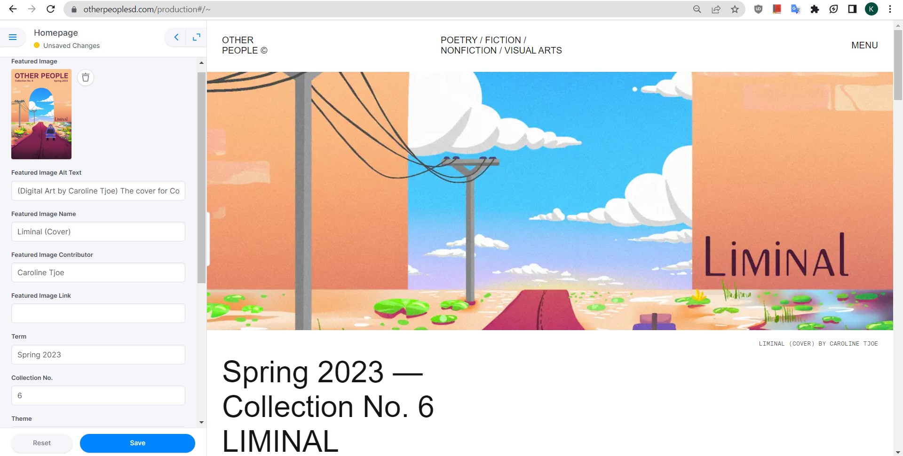
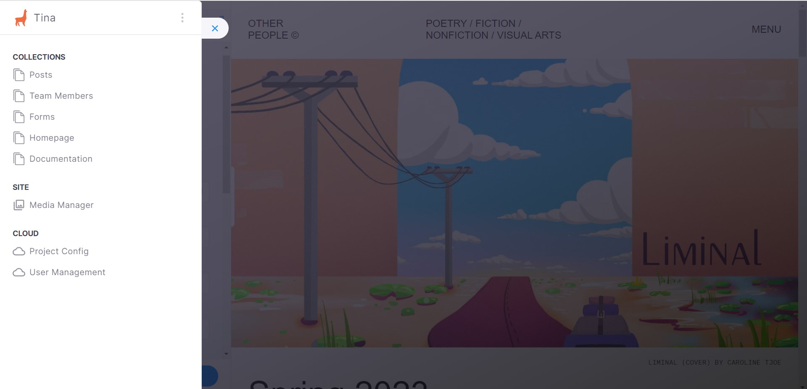
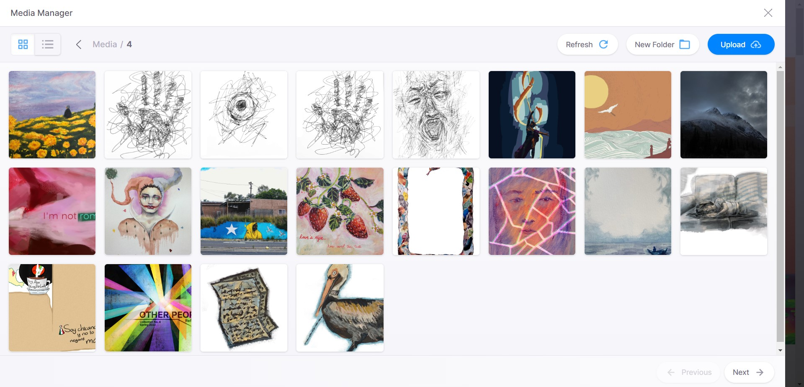

## Prerequisite Knowledge

This document assumes that you know Markdown, HTML, CSS, have worked on a content management system (CMS) before and have sufficient technical literacy.

## About the Role

As Website Producer for Other People Magazine, you are tasked with publishing prose and art as well as updating information such as submissions status, applications, the team page, and other information. You do not necessarily need to code in HTML/CSS but it is recommended that you do to adhere to the wishes of authors that make stories with designs that aren't possible in Markdown.

## TinaCMS

TinaCMS comes with a straightforward live editing feature that allows you to edit posts side-by-side. This is a feature that the discontinued Forestry.io CMS from pre-v3.3.3 Pink-Currents did not have. If you have used modern CMSes like WordPress or Wix, this may feel very familiar to you. Being able to optionally code works allows us to create experimental stories like "Missed Connections (1 new post)" and "You Have Created an Imaginary Friend" as standalone pieces on our own website and can be transferred reliably to other website frameworks that WordPress may not be able to support easily.

To start, visit the [production page](https://www.otherpeoplesd.com/production). Log in to Tina.io through the OPM credentials. 

On the left is the TinaCMS interface and you’ll notice that there are fields that have the same information as components on the homepage of the website! As a website producer, your task is already laid out in the interface information. If you want to edit the homepage cover image, you replace the Featured Image with another image, if you want to change the number of posts displayed on the homepage, there are fields to do that as well! You can even resize the interface to test how the page will look on a desktop screen and even smaller widths for mobile devices. 

At the top-left of the TinaCMS interface is a hamburger slider that will open the Global Navigation pane. You will see a list of Collections, Site, and the Cloud.

### Collections

Collections are where the editable parts of the website are found! The documentation folder is mainly for developers but there might be information useful for troubleshooting stuff there.

Some of the sections edit single pages such as Homepage, others may not have a specific page they edit, and Posts contains a list of folders. The collection interfaces contain semantic fields and some may include descriptions of how and where they are used. For example, the Forms collection contains fields to input application forms. Reading the description would let you know that inserting a link to that field will make the application on the about page and links page appear!

The Posts collection holds all of the stories we publish. **Please do not create stories inside the Posts collection and instead publish them in a folder for organizational purposes.** Clicking on a folder will show all of the stories published. Please view a few of the stories to get a sense of how they were written before publishing your first work! You may notice that a lot of them contain HTML while the earliest stories in Collection No. 1 and 2020 may be written completely in Markdown. It is up to you to write the stories in pure Markdown as you don’t need to code! The reason why some stories use HTML is mainly to support styling images because they can be too large or if they should be centered in a story or not. 

The required fields are Title, Date, Contributor(s), Tags, and to write something in the content body. You may notice custom components at the bottom of the interface such as Theme and Content Warning. Please read the description of custom components to know how they work. You shouldn’t need to click or type anything for custom components if the story does not use them.

If you experience duplicate folders under Posts, please refer to the Project Config paragraph to fix this issue.

### Site (Media Manager)

This is where media files are uploaded and accessible from. Please upload compressed images as described in [File Naming and File Size Management](./uploading-media) because we have space limitations on the website and large media files is the main contributor to space. 

The media folders only display 20 images per page, so there is a small Back/Next button at the bottom to view the other images!

### Cloud

These are developer settings for the CMS. On the free plan, only two users can be added to the project. Due to this, you will be producing through the Other People email account while the current website developer/maintainer should be reserved for the other user.

The Project Config will take you to the configuration page. As a website producer, you  should not modify any of the configuration information because it can make the CMS inoperable to you. ~~However, if you experience duplicate collection folders you do need to reset the repository cache. This is done by clicking on View Advanced Settings on the right and then click on **Reset Repository Cache**~~ Issue resolved in a TinaCMS update.
