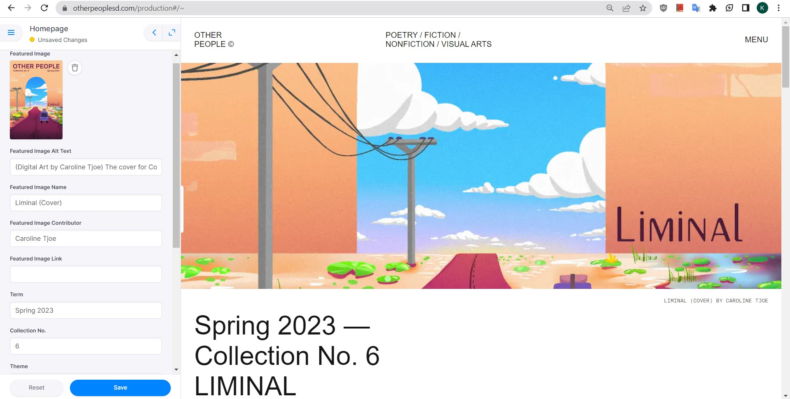
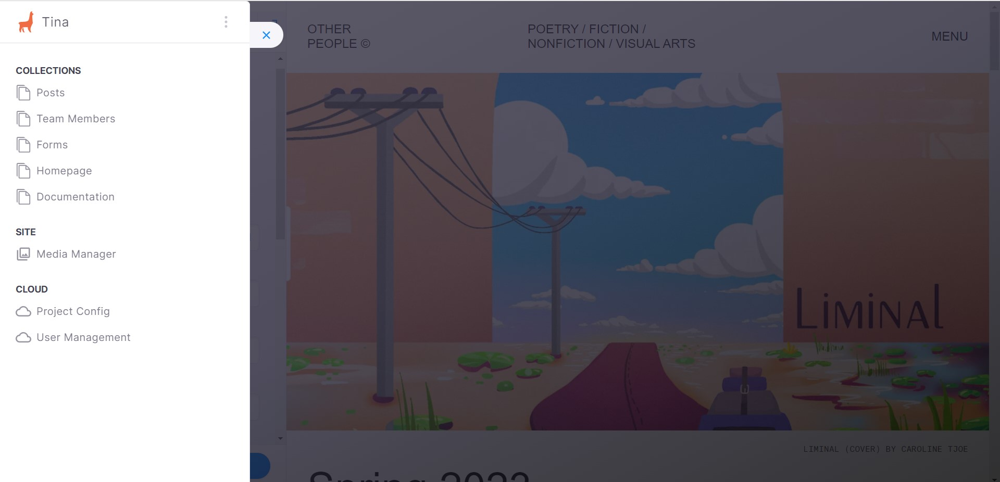

```mdx-code-block
import Tabs from '@theme/Tabs';
import TabItem from '@theme/TabItem';
import styles from './index.module.css';
```

## Prerequisite Knowledge

This document assumes that you know Markdown, HTML, CSS, and have sufficient technical literacy.

## About the Role

As Website Producer for Other People Magazine, you are tasked with publishing prose and art as well as updating information such as submissions status, applications, the team page, and other information. You do not necessarily need to code in HTML/CSS but it is recommended that you do to adhere to the wishes of authors that make stories with designs that aren't possible in Markdown.

## TinaCMS

TinaCMS comes with a straightforward live editing feature that allows you to edit posts side-by-side. This is a feature that the discontinued Forestry.io CMS from pre-v3.3.3 Pink-Currents did not have. If you have used modern CMSes like WordPress or Wix, this may feel very familiar to you. Being able to optionally code works allows us to create experimental stories like "Missed Connections (1 new post)" and "You Have Created an Imaginary Friend" as standalone pieces on our own website and can be transferred reliably to other website frameworks that WordPress may not be able to support easily.

To start, visit the [production page](https://calla-lily-git-publishing-other-people.vercel.app/production/index.html). Log in to Tina.io through the OPM credentials. Get 2FA from your current maintainer after confirming you are **publishing on the publishing version from this link**.

:::info
None of these edits will show up on the actual website. This is to maintain code quality because each time you save a file, it gets recorded. Therefore, you can keep editing without worrying that you broke the public site. When you are finished proofreading the drafts, contact the current maintainer to complete the publishing process to the public website.
:::



On the left is the TinaCMS interface and you’ll notice that there are fields that have the same information as components on the homepage of the website! As a website producer, your task is already laid out in the interface information. If you want to edit the homepage cover image, you replace the Featured Image with another image, if you want to change the number of posts displayed on the homepage, there are fields to do that as well! You can even resize the interface to test how the page will look on a desktop screen and even smaller widths for mobile devices. 

At the top-left of the TinaCMS interface is a hamburger slider that will open the Global Navigation pane. You will see a list of Collections, Site, and the Cloud.



### Collections

Collections are where the editable parts of the website are found! The documentation folder is mainly for developers but there might be information useful for troubleshooting stuff there.

Some of the sections edit single pages such as Homepage, others may not have a specific page they edit, and Posts contains a list of folders. The collection interfaces contain semantic fields and some may include descriptions of how and where they are used. For example, the Forms collection contains fields to input application forms. Reading the description would let you know that inserting a link to that field will make the application on the about page and links page appear!

### Site (Media Manager)


This is where media files are uploaded and accessible from. Please upload compressed images as described in [File Naming and File Size Management](./uploading-media) because we have space limitations on the website and large media files is the main contributor to space. 

The media folders only display 20 images per page, so there is a small Back/Next button at the bottom to view the other images!

:::info
One caveat to uploading media here is that it will be saved in Tina Cloud. This means people's artwork will be stored on a third-party cloud service in addition to our main dataset. The method to avoid this is to go directly to the source code dataset and upload there.
:::

### Cloud

These are developer settings for the CMS. On the free plan, only two users can be added to the project. Due to this, you will be producing through the Other People email account while the current website developer/maintainer should be reserved for the other user.

The Project Config will take you to the configuration page. As a website producer, you should not modify any of the configuration information because it can make the CMS inoperable to you. 

## Publishing Posts

Publishing posts should appear straightforward to do if you have used another CMS before. When clicking on the Posts collection, there will be a set of folders available to you. These folders could be a small number such as 1, 2, 3 or a year such as 2019, 2020, 2021. The small numbers represent the collection/issue number and this is where accepted submissions from people outside Other People Magazine should go. The yearly folders are where our content writing team gets their works published if they did not get their work published in a magazine issue.


The view should be sorted by `date` by default. This is useful to see the posts that were most recently published. The only other useful sort option is `name` because the interface only displays the shown columns and you cannot add additional columns to it.

Now you are ready to create a post, fill out the content, and publish it!

:::warning
You should not publish posts at the top-level (not inside a numbered or year folder) because this will make organization in the future difficult as the magazine grows in size. Currently TinaCMS does not have a "Create New Folder" option so you do have to ask a developer to make the folder for you.
:::

### Creating a Post: Metadata

When you first create a post by clicking on the `Create New` button, you will only see a form. This view is much different than if you had clicked on an already published post because you must save the initial file so that it can be read by the internal system to give you the preview feature. This will have a list of fields with descriptions to help guide you on what should go into the field. You can also look at other posts for reference if you are confused about anything. **Any field marked with an asterisk is required**. 

You will usually only have to fill out the fields up to the `Body (content)` as the fields below the content are custom components that give more control over how the post is displayed. If this is your first time using the custom components, please do not select or fill out until reading the next section. If you made any mistakes, the reset button will clear all fields. You can also exit the create page to discard all changes.

For now, it is okay to only fill out the required fields and to leave the body blank or a complete copy-paste of the work you are going to publish. This will be fixed up in the next section when you can utilize the live preview feature.

Click Save to finish creating the post and proceed to the next step. 

:::tip
If creating the first post for a new Collection or year, prefix the title with the number (e.g. publishing Collection No. 12, set title as `12/editors-note`). This will create a new folder called `12` with the file `editors-note` inside it. 
:::

### Creating a Post: Editing the Content

After saving the initial post, you will have to wait at least 1-3 minutes for the website to finish compiling and redeploying. Just refresh the page after a few minutes passed and you should see the post show up in the CMS again! This time the form will move to the left sidebar and the webpage will show what the published page will look like. This is the live editing feature of TinaCMS which makes this CMS similar to the other modern CMSes like WordPress or wix. It is time to edit the content and reformat it to be like the final draft.

#### Poetry

If you paste lines of poetry from the final draft, it may appear like this.


While the content appears to be in line breaks, it does not show the line breaks on the final page. The reason for this is that the content field is showin in a "visual editor" format and this is a common pitfall of many modern CMSes because certain things like line breaks will not show up properly in this format. To resolve this, you must first click on the three dots in the content field and select the `Raw` option to view the field in raw text format.

Now you have three options to put in a line break in the raw text format.

```mdx-code-block
<div style={{backgroundColor: 'var(--ifm-color-code-block)', borderRadius: '20px', padding: 8}}>
<Tabs>
  <TabItem value="br" label="HTML: <br /> &#11088;" attributes={{className: styles.green}} default>
    <p>Use <code>&lt;br /&gt;</code> at the end of a line</p>
    <p><strong>Pro:</strong> All users will see the page in HTML, so supporting the post using HTML elements is ideal as the entire page can be exported without changing much information on it. This is very important when managing hundreds of posts as this will keep maintenance low.</p>
    <p><strong>Con:</strong> It must be typed exactly like this with a space between the <code>r /</code> because this will take care of device compatibility on legacy browsers and pass the linting check. Using only <code>&lt;br&gt;</code> will fail because the website is built in React and all tags must have an enclosing tag or leading slash <code>/</code> to keep the code secure from escaped data.</p>
  </TabItem>
  <TabItem value="backslash" label="MD: Backslash" attributes={{className: styles.blue}}>
    <p>Use a backslash <code>\</code> at the end of a line</p>
    <p><strong>Con:</strong> If changes to the parser are made, the backslash may be recognized as an escape character and break the page in the future.</p>
  </TabItem>
  <TabItem value="doubleSpace" label="MD: Double Space" attributes={{className: styles.red}}>
    <p>Use double spaces at the end of a line</p>
    <p><strong>Con:</strong> Visually, you cannot spaces on the editor so this makes it hard on everyone to debug. The parser may also break if it trims whitespace from the end of lines.</p>
  </TabItem>
</Tabs>
</div>
```

Poetry can consist of line breaks and stanzas and formatting is used differently for both. The line breaks take care of the case of lines within a stanza, but to separate stanzas you just enter a real line break in between the raw text.

```mdx
and don’t believe the glassy-eyed assemblage of faces<br />
who ramble nonsense like<br /> <em>oh, she was such an angel...</em><br /> 
<em>oh, she died too young at twenty-one...</em>

I hate cliché decorum, <br />
but nowhere near as much as I hate that <br />
in twenty-one years I couldn’t escape from mediocrity
```

#### Prose

Prose can be styled in the "visual editor" format by itself and use the markdown syntax. But we still recommend using HTML for the compatibility and portability as explained in the HTML vs Markdown line break comparison. You will rarely use `<br />` tags for prose because most of it is paragraphs and you won't encounter many writers doing line breaks with no space in between those lines.

:::tip
&lt;br /&gt; = no space between lines<br />
Line break (enter key) = paragraphs, stanzas, or spacing in between lines
:::

#### Arts/Media

Images can be written in Markdown (``) or HTML (``), but it is still recommended to use HTML to utilize styling. Markdown images will be left aligned and cannot be centered on the page. They can also be sized to the width of the post space which may make it hard to view portrait illustrations. Limiting the size and also deciding on the image layout are things that HTML is able to control.

The classes commonly used to set a width constraint are specified in [customPosts.css](https://github.com/Other-People-UCSD/Calla-Lily/blob/main/styles/customPosts.scss) as `w250, w450, w650`.

Left-aligned image (good for poetry or if the first lines of text mainly occupies the left side of the page)
```html

```

Centered image (good for a first starting paragraph or a first centered line in the story)
```html
<div class="center">

</div>
```

:::note
There is a forward slash in the img element to comply with the React syntax just like in &lt;br /&gt;.
:::

### Afterword

You may notice that some pages have unique styles such as [Retreat](https://www.otherpeoplesd.com/4/retreat), [Cognates](https://www.otherpeoplesd.com/5/cognates), and [poets sleep in graves](https://www.otherpeoplesd.com/2023/poets-sleep-in-graves) using only HTML and CSS class names. As a web producer, you are not expected to make new posts pop out as this if you do not have enough proficiency to style HTML in such a way, but I am sure that you will learn a lot in this role and might elevate yourself to modifying the `customPosts.css` file to make this happen!

## Submissions Page and Applications

You should go to the [public website editing page](https://calla-lily-git-main-other-people.vercel.app/production/index.html). Log in to Tina.io through the OPM credentials. Get 2FA from your current maintainer after confirming you are **editing the forms on the public/main version**. These changes will immediately show up on the public website and should only be used for updating minor data like forms.

In the TinaCMS sidebar go to the Forms collection. Modifying the submissions page is different from the other sections here because there is no live preview for edits. Instead you just see a form with a bunch of labeled fields with their purpose. 

For submissions there are three fields to edit. The `Submission Form` fields take in a URL for the form and the third field is a text editor to display text if submissions are closed. Under the hood, the webpage will say if submissions are open if there is something in the Submission Form field, otherwise it will say closed and display the text in the third field. This simplifies the page so you don't have to modify a whole text box when the submission guidelines rarely change and can be rewritten within the submission form itself.

Updating application forms is straightforward as there are fields for each team. Updating the links here will update every place where the application link can be found.
```json
{
  "written": "Submissions Form URL",
  "visual": "Submissions Form URL",
  "subsClosedText": "Our submissions are now closed for the rest of the school year. We will continue to update this page with open calls for submissions from other orgs at UCSD!\n",
  "editorial": "Application form URL",
  "content": "Application form URL",
  "design": "Application form URL",
  "events": "Application form URL",
  "website": "Application form URL"
}
```
[Read this section to understand why the data is saved this way.](./calla-lily/schema#formsjson-data)

## Team Page

Use the editing page link from the previous section.

In the TinaCMS sidebar go to the Team Members collection. The live preview editor will show a fields categorized as teams with people's name in cards. This should be very self-explanatory where you add a card into the team category by clicking on the plus button and then you can enter in a new member's name and their exact role. You can use the slider on the left side of each card to organize the names. To edit alumni with starting and ending years, you can always ask when someone joined the team!

You may notice that the names aren't in alphabetical order. They are traditionally ordered by role importance > seniority > alphabetical where seniority applies to date joined. For example if a group of people were recruited then you sort them alphabetically by first name. If people were accepted on a rolling basis they are sorted by time joined. 