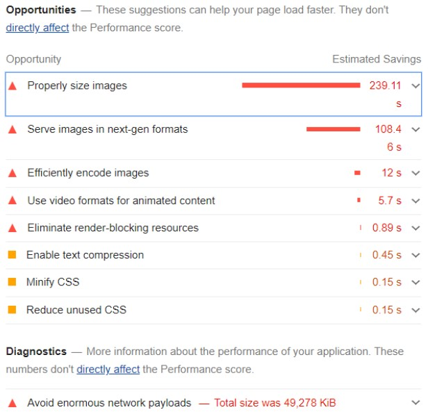

# Image Compression: Thumbnails

:::important

This section must be used in Pink-Currents to reduce network load on the homepage and genre pages. Calla-Lily uses image optimization from Next.js which significantly reduces network bandwidth but this thumbnail method is still better than the automatic image optimization. See the [Calla-Lily release notes](../calla-lily/calla-lily-release#thumbnails-v4531) for more information.

:::

There are two formats that make it more efficient for end-users: AVIF and webp. While AVIF has stronger compression, it isn’t supported in many browsers. Instead we will use webp where the compression size difference is negligible at how small our 80px thumbnails are.

## The Thumbnail Script

:::warning

Read the entire section + Pipeline before creating thumbnails. This can dangerously affect media files if not done properly!

:::

:::tip

Always perform the image resizing on a new branch to work on a copy of the files.

:::

Find all of the regular images in /public/images/[folder] that are not JPG, JPEG, PNG

Pink-Currents/$
```
find ./origtemp -maxdepth 1 \( ! -iname "*.jpg" -and ! -iname "*.png" -and ! -iname "*.jpeg" \)
```

Use this command first to scan the folder for the files that will not have a thumbnail. Then move all of those files out to a different temporary folder. Do this because you do not want to make a webp for each frame. It is an inconvenience when you accidentally do it on a GIF and even worse if you do it on a video… Please double-check by eyeballing the folder for only non-movie types, and then proceed!

Next you will change directory to the folder. 

Pink-Currents/origtemp/$
```
find ./ -maxdepth 1 -type f  \( ! -iname "*.gif" -a ! -iname "*.pdf" \) | xargs mogrify -thumbnail 80x -path ../thumbs -format webp "{}"
```
### Pipeline for Thumbnails

1. Make a temporary folder for the images (e.g. `origtemp`).
2. Make a temporary thumbnail folder (e.g. `thumbtemp`).

```
/
├── uploads     # Folder for media and images, organized into folders
├── assets      # Styling the website
|   └── thumbs  # Folder for webp images used in home and genre previews of posts
├── origtemp
├── thumbtemp
...
```

3. Upload all new images used for thumbnails to `origtemp`.
4. Make sure there are no videos/multi-frame files in here. Otherwise a thumbnail will be generated for every frame in it.
5. Change into the origtemp directory.
``` 
cd ./origtemp 
```
5. Run the thumbnail script with dest folder `thumbtemp`
```
find . -maxdepth 1 -type f | xargs mogrify -thumbnail x80 -path ../thumbtemp -format webp "{}"
```
:::warning
This will convert ALL files in `origtemp`.
:::
6. Check that there are an equal number of files and their names are correct.
7. Move the new thumbnails from `thumbtemp` into ./assets/thumbs.
8. Move the images from `origtemp` back into the main image folder `uploads` if they aren't already in there.
9. In the front-matter for each post, put the thumbnail url as "[title].webp" into the `thumb` field. The path is generated in the layout page in case someone moves the folder to a different destination.

The significance of this thumbnail script can be seen in the following two Google Lighthouse audits.

***Google Lighthouse Audit: Full-Sized Images***



***Google Lighthouse Audit: Thumbnail Images***


:::note

At the time the audit was taken, the homepage featured image was not compressed. That contributed to several MB of data. What is important to see is that the time to load media on the page is now 84% faster as a result of the thumbnail images.

:::
