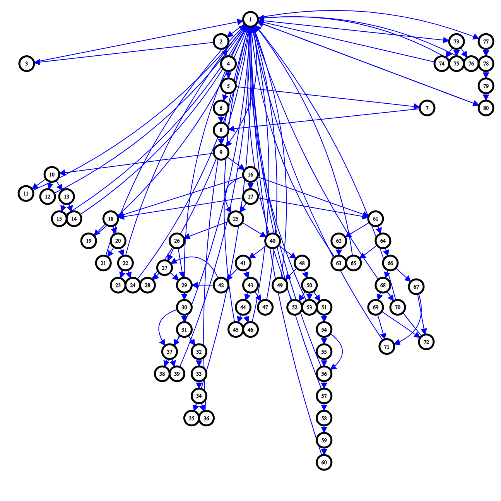
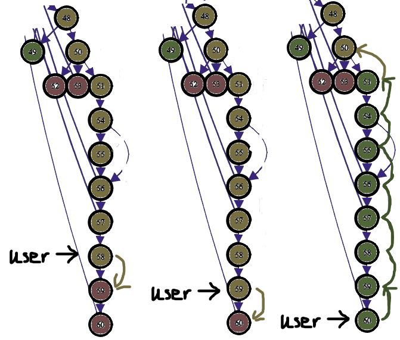
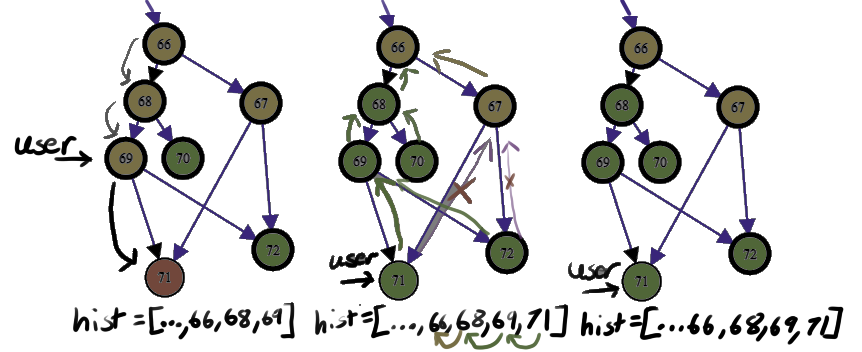
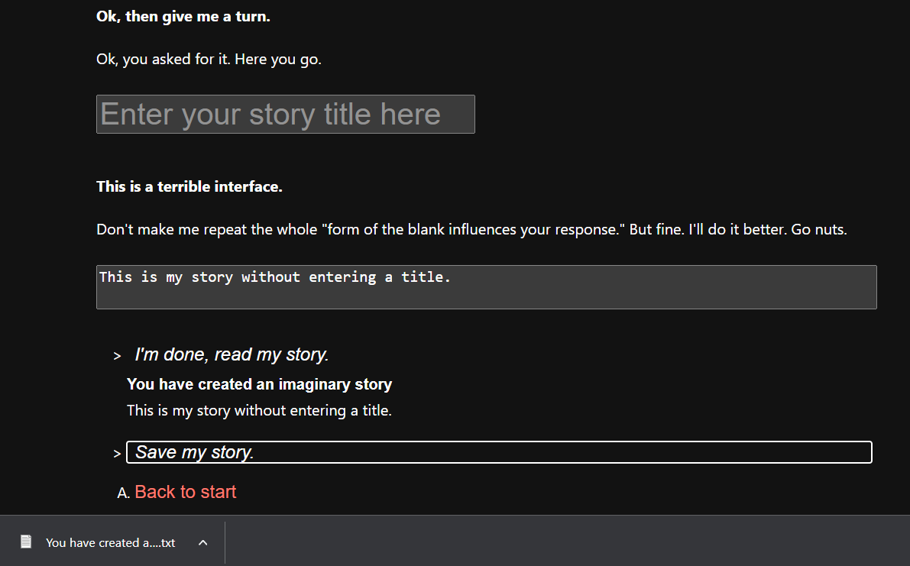
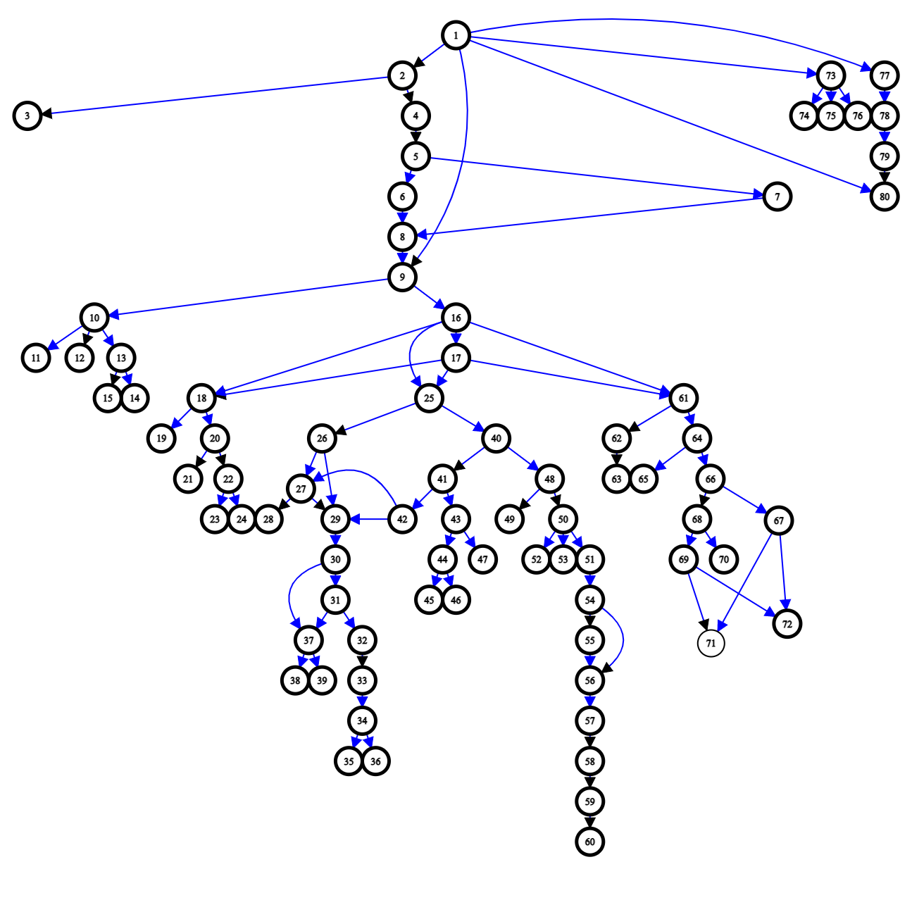

:::note
Written as used in Calla-Lily
:::

[You Have Created An Imaginary Friend](https://www.otherpeoplesd.com/6/you-have-created-an-imaginary-friend)

[cyoa.js (source code)](https://github.com/Other-People-UCSD/Calla-Lily/blob/main/public/js/cyoa.js)

["You Have Created An Imaginary Friend" JSON data](https://www.otherpeoplesd.com/js/imaginary-friend-theo-erickson.json)

## Abstract

The choose-your-own-adventure (CYOA) program is meant to give the end user a more understandable experience of the story
by allowing them to see their progress through the story. This documentation goes through the CYOA workflow using Theo
Erickson’s “You Have Created An Imaginary Friend” story as a reference.

## Context

Many CYOA stories may be drafted as a Twine or other dialogue story file. Twine has an undo and redo feature for
passages, but lacks any progress indicator for the user to see how long the story is. This lack of indicator can confuse
users who think there isn’t more to the story if they get lost and keep repeating routes. In addition, publishing a
Twine file can take the form of a third-party website that we cannot manage, or a standalone HTML file. That HTML file
does not work well with the Jekyll-based and React-based website’s ability to template an HTML page. For an enhanced UX
and UI experience that can natively run on the Other People Website via DOM injection, our own CYOA program is used.

## Timeline

* February 24, 2023 - April 11, 2023: Minimum Viable Product of cyoa.js
* February 24, 2023 - April 21, 2023: Creative Edits on story
* April 22, 2023 - May 24, 2023: Copy Edits on story
* May 23, 2023 - May 31, 2023: Final cyoa.js Website Edits for "You Have Created An Imaginary Friend"
* June 2, 2023: Public release of "You Have Created An Imaginary Friend"

## Data Pipeline

### Raw Text Data Editing and Storage

It can be difficult for staff editors to edit the story off Twine when the Twine file does not syncronize editing state
when it can only be imported by a .twine file. Instead, CYOA stories should be written in a collaborative text editor
such as Google Docs where all viewers will see the same version. To organize the story, each passage should be on its
own page. Adding a header such as the route or id number allows for internal hyperlinks to work where routes from other
passages can link to and it makes stepping through the story arc feel very similar to Twine or the CYOA program.

### Data Extraction

After completing the story in a collaborative text editor, the raw text is put into a spreadsheet. This is necessary to
organize the data in a way that a popular programming language can read rather than using something like Google Apps
Script to extract the spreadsheet data, especially if a passage extends more than one page. The downside of using a
spreadsheet is that it is harder to review the raw text as compared to a text editor, so this is something that the
website developer is expected to set up.

The main columns for the spreadsheet are **id **(unique) and **passage text**. Passage text includes the main text to display on
the story, but not the routes the user can click on. Instead, routes are saved in a two-column repeating form where the
first column is the **id to route to** and the second is the **route text**. This is repeated in the spreadsheet such that
individual route options can be modified in an easier fashion rather than adding all routes into one spreadsheet cell
with some delimiter to separate them.

> | id | passageText | to | text | to | text | ...

After transferring the raw text to the spreadsheet, passages that require further interactivity can have the text
modified to include HTML/CSS elements such as buttons or different styles. JavaScript can be added to the text here, but
it will not activate on the React-based website. Instead, the CYOA program automatically adds the interactive event
listeners on-demand during program execution.

Exporting spreadsheet data commonly takes upon a delimiter-separated format. Google Sheets and Excel support both
comma-separated values and tab-separated values, but only tab-separated values work effectively here. This is because
storywriting often uses commas when writing dialogue, so those commas in **passage text** will affect how the column-based
data is separated and read. Instead, tab-separated values will usually work because intentional tabs are rarer in
storywriting and thus tab occurrences in the text can be replaced with unicode encodings. It would not be friendly to
read data that has hundreds of unicode-encoded commas scattered in every passage.

### Data Transformation

The exported .tsv file must be slightly modified such that each passage of the story is on its own page. Sometimes, the
passage text might create line breaks between paragraphs that mess with the way the .tsv file got saved. Removing the
line breaks and then using **double spaces **between the paragraphs will ensure that the tsv file has the same number of
lines as the number of passages in the story.

The reason why paragraphs have their own double-spaced delimiter inside the tsv is because the hybridized text may be
raw text or HTML. If a passage is raw andtext there are multiple paragraphs, the data has to understand that there are
multiple paragraphs that cannot be demarcated by a single space since a story will have spaces throughout it. Double
spaces are rarer and can be unicode-encoded as well. Another option is to just change the delimiter used to something
else.

The .tsv file should now be formatted at this stage. To extract the data from the .tsv file, a Python script is used.
The main reason why this data extraction and transformation is done in Python instead of JavaScript is because it was
easier to work with data locally through a notebook instead of waiting for an synchronous HTTP request to get the data
from the .tsv file and then transforming it into JSON that could be used more easily in the program. The python
algorithm reads the tsv file line by line and creates a JSON object in the following format:

```
{
  “story”: [
    “id”: Number,
    “passageText”: [String],
    “routes”: [ { “to”: Number, “text”: String }]
  ]
}
```

The diagram below shows the directed graph in tree format of the eighty paths in “You Have Created An Imaginary Friend”.
There are 126 paths with 33 of them going back to start.



### Data Storage

This JSON object is written to a .json file which will then be stored inside the /public/js folder on the website. The
object is already minified from the python script so there is no need to expand it unless edits to the story data need
to be made. **The “You Have Created An Imaginary Friend” JSON file is 85.1 KB in size.** It is also a more hidden resource
that cannot be found on the sources tab in the /js folder, but can still be identified by looking through the network
log.

As for the webpage where the data is deployed, the markdown file content must contain an element with the id “story-ref”
for the program to find the filename of the JSON file. There must also be a div with the id “output-text” where the
algorithm writes the passage data to. Optionally, there is a progress container for the progress bar and a reset button.

## Algorithm

Refer to the JSDocs documentation for information on the specific functions. Otherwise, this is a general workflow of
how the program operates.

When the webpage is loaded, the program will fetch the data stored in the JSON file. It will store the data in a global
variable that allows the program to refer to the data as the user goes through the story. In addition, loading the
webpage by either navigating away or hard refreshing the page will reset any route history the reader has had before.

Passages are written according to their **0-indexed** position in the stored array. If the passage text is identified as
text when there are no HTML tags present in it, then the text will be appended to the page in a paragraph tag. Otherwise
the text is in HTML format and is directly appended to the page. If there are buttons in the HTML paragraph, event
listeners will be added to them based on the events that were passed in as attributes to the button.

After appending the passage text to the screen, the route options are created. Each option is a button list item with a
clickable event listener function that will display the route in bold once it is clicked on, updates the visited state
of the taken route, and shows that next passage. These options are styled based on their visited state: red for not
visited, orange for partially visited but some subroutes have not been visited yet, and green for fully visited.

This route visited state is stored in a **0-indexed array** with length to the number of passages in the story. Whenever the
visited state of a route changes, the state is stored in local storage so that the reader can keep track of their
progress. In addition, a history stack will push the traveled passage id to allow the user to go back if they would like
to. It does not make practical sense to have a redo button when the list of options will also display again. If a route
has reached the end, then it is marked as fully visited and given a value of 2 in the array. When this happens, **changes
are bubbled up** through the directed graph of the story by using the history array. This function improves user
understanding of where they have gone as the entire leaf of a route tree will turn green, allowing the user to pick the
other branches at the intersection to continue reading unexplored paths in the story.



The limitation of this bubbling up of state is that other parent routes that will satisfy the fully visited condition
will not be affected because this is dependent on the history stack. This can have potential side effects up the tree,
as nodes 66 and 67 in the following diagram should both be green after the user routes to node 71. Solving this case may
improve coverage for the user at the cost of algorithmic efficiency to color routes.



The progress bar updates when an unvisited route is clicked on. There have been reported cases where it can go one over
the number of passages in the story. To resolve this, once all routes have been visited the progress bar is set to the
number of passages in the story and sets all route states to completely visited.

Some paragraphs contain special actions that extend the functionality of displaying passages. While it is possible to
try to run actions on every passage, it is optimal to run an action only if the passage has an action. These actions are
often dependent on conditions to function, so refer to the program code to see how each action is run. For example, the
main passage where the reader starts from has a fifth route that is hidden if the reader hasn’t reached the true main
route of the story. This action checks local storage for the variable that keeps this state and then unhides the route
if the condition is met. Other events include adding special event listeners to elements that don’t act like the usual
buttons with events that are already handled when the passage is created.

The reset button is implemented as a way to reset the visited states over the routes and any local storage variables
associated with the story. This currently works over “You Have Created An Imaginary Friend”’s local storage variables
but there are multiple ways to conditionally reset the variables associated with the story being displayed. That is
something that can be exported in the future when this case arises.

“You Have Created An Imaginary Friend” has a special function that allows the user to input their own text and see it
displayed on the page. This includes a text input for a story title as well as a textarea that resizes itself so it
won’t take up too much space and lets the user see everything they have typed instead of a scrollable element. This
storywriting component also has an option to save the user’s story. This is done by creating a temporary hidden link and
attaching events to download a text file with the story encoded into it, then automatically clicking it using
JavaScript.



## UX/UI Design

With the assistance of Katie Lew, the UI designer, changes were made to make the progress bar narrower and other spacing
between text. End users have a better context about how routes and inline buttons that had actions were clickable by
adding hovering styles that outlined the elements. The width of the buttons was also increased to cover the entire row
instead of only the text content because some routes have very little text and might have been difficult to select for
some users.

The route color for yellow/gold is also slightly different on dark theme devices for a better contrast against the dark
background and the other two route colors. All input and button sections have appropriate styles on dark theme as well.

Aria descriptions were added to the buttons that the user can be interacted with. For the list of routes the user can
take, the list has a description that indicates that the following buttons are route options. Individual routes do not
have an aria description because the flow of hearing the description every time interrupts with its content and the
description on the list already explains the purpose of the component.

## Future Extensions

This CYOA program can be greatly extended to provide a better user interface! Some significant examples include audio
snippets over each passage, a theme changer that can be implemented exclusively for the program or globally over the
website, instructional information, and more interactive elements on individual passages!

The main goal is to keep the CYOA program modulated and reusable over multiple stories without having to modify existing
core algorithms of the program. Internally, it can be a good idea to make the CYOA program take options such as if the
back and reset button and the progress bar should be displayed for each story that uses the program.

Another diagram of “You Have Created An Imaginary Friend” without the edges back to start (node 1).


